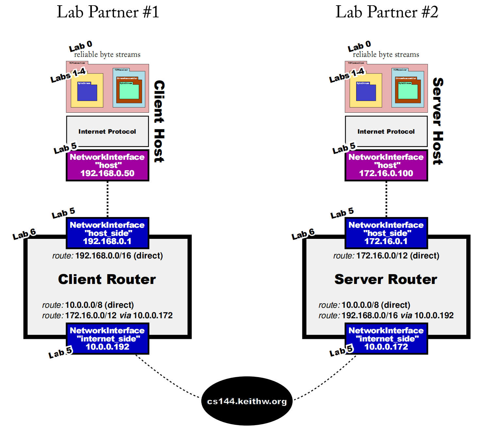

#### 从头开始设计和实现一个简化的基于TCP/IP的网络协议栈(基于https://cs144.github.io/)

简化的基于TCP/IP的网络协议栈包括以下几个部分：
- 数据链路层：实现基本的帧格式和传输机制，处理数据的封装和解封装
- 网络层：实现 IP 协议，包括地址解析、路由选择和数据包转发
- 传输层：实现 TCP 或 UDP 协议，处理连接管理、流量控制和错误检测
- 应用层：使用设计的TCPIP协议栈进行简单的应用层通信，以便在服务器端和客户端进行数据传输

#### 项目运行流程
运行script文件夹下的run_start.sh可以一键安装所需的软件包和本地编译测试，并在/var/log/package_install.log下观察执行日志
- Linux> chmod +x ./script/run_start.sh
- Terminal1> bash -x ./script/run_start.sh
- Terminal2> tail -f /var/log/package_install.log

#### 项目总览和文件功能
```
├── apps                    # 使用src中构建的TCPIP协议栈进行服务器/客户端通信等功能
    └── ......
├── etc
    ├── build_type.cmake    # 设置cmake编译时的构建类型配置编译选项和链接库
    ├── cflags.cmake        # 设置cmake的编译选项
    ├── scanners.cmake      # 设置代码格式化和静态分析工具clang-format和clang-tidy的构建目标
    └── tests.cmake         # 设置cmake的测试用例选项，对src的源代码进行test测试
├── scripts
    ├── lines-of-code       # 使用sloccount统计src文件的源代码行数
    ├── make-parallel.sh    # 进行cmake编译时使用与系统CPU核心数相同的并行任务数
    ├── run_start.sh        # 一键构建包管理、编译环境和自测试代码脚本
    ├── tun.sh              # 管理TUN设备，包括启动、停止、重启和检查设备状态，通过ip和iptables配置网络接口和NAT规则
    └── webget_t.sh         # 验证从指定URL获取的哈希值是否与预期值相符，确保数据的完整性和正确性
├── src
    ├── byte_stream         # 构建ByteStream字节流，提供了流的基本功能，使用容量为capacity的buffer用来进行流量控制
    │   └──......
    ├── network_interface   # NetworkInterface类将网络层与链路层连接起来负责将IP数据报转换为以太网帧
    │   └──......
    ├── reassembler         # 实现一个流重组器，将tcp_receiver中接收到的字节流中的segments拼接还原为其原本正确的顺序
    │   └──......
    ├── router              # 实现一个IP路由器，负责将接收到的数据报根据路由表转发，从哪个网络接口转发以及下一跳的IP地址
    │   └──......
    ├── tcp_receiver        # 将从Internet接收的segments送入Reassembler转为可靠的ByteStream，以供应用层从socket读取
    │   └──......
    ├── tcp_sender          # 负责将应用层的ByteStream分割为段发送，根据接收方的反馈情况进行超时重传
    │   └──......
    ├── wrapping_integers   # 进行字节流的sequence number序列号转换
    │   └──......
    └── CMakeLists.txt
├── tests                   # 对src中的源代码进行测试，并输出字节流传输和重组的速度测试
    └── ......
├── util                    # 底层工具类，使用C++封装了POSIX中的socket和事件循环等主要功能，屏蔽细节
    └── ......
├── CMakeLists.txt          # 项目编译cmake文件
├── LICENSE                 # Apache证书
└── README.md               # 项目简介和描述
```

#### 项目总体框架


#### 项目主要功能

在一个简化的基于 TCP/IP 的网络协议栈中，数据流动的过程如下：首先，应用层生成要发送的数据，并通过 tcp_sender 类将其传递给传输层。在建立连接时，tcp_sender 会执行三次握手过程：首先发送一个带有 SYN 标志的 TCP 段，目标主机的 tcp_receiver 接收到该段后，回复一个带有 SYN 和 ACK 标志的段，最后，发送方再发送一个带有 ACK 标志的段，连接建立完成。接下来，tcp_sender 接收到数据后，将其分割为多个 TCP 段，并为每个段添加 TCP 头部信息。然后，这些 TCP 段被传递给 NetworkInterface 模块，后者将其封装为 IP 数据报，添加源和目标 IP 地址等信息。

在此网络栈中，数据从传输层传递给 NetworkInterface 模块后，首先会通过 tun 接口实现对数据包的传输，进而进入网络层进行进一步处理。tun/tap 接口提供了一个虚拟化的网络设备，使得数据流可以在用户空间进行处理，而无需通过物理网络接口。

在发送 IP 数据报之前，NetworkInterface 会使用 ARP 协议解析目标 IP 地址，获取目标主机的 MAC 地址。随后，IP 数据报被进一步封装为以太网帧，通过数据链路层发送到目标主机。数据链路层负责将以太网帧发送到物理网络中，数据在网络中经过多个路由器时，路由器根据路由表选择合适的下一跳，进行路由转发。

目标主机的网络接口接收到以太网帧后，数据链路层解封装帧，提取出 IP 数据报，并将其传递给网络层。网络层根据目标 IP 地址将数据报传递给 tcp_receiver，后者将接收到的 TCP 段送入重组器（Reassembler），以确保数据按正确顺序重组为完整的字节流。Reassembler 会将接收到的 TCP 段按序列号进行排序，并将其传递给 ByteStream保证字节流是可靠的，以便应用层可以顺利读取数据。数据传输完成后，若需要关闭连接，tcp_sender 会执行四次挥手过程：首先发送一个带有 FIN 标志的 TCP 段，目标主机的 tcp_receiver 回复一个带有 ACK 标志的段，然后目标主机发送一个带有 FIN 标志的段，最后发送方再发送一个带有 ACK 标志的段，连接关闭。最终，重组后的字节流可供应用层读取，完成数据的传输过程。

#### 项目相关技术
1.使用抽象基类、异常处理和模板方法定义测试工具类:
- 抽象基类：定义一个通用的测试接口，允许不同的测试类实现特定的测试逻辑。通过这种方式，可以在不修改基类代码的情况下扩展新的测试类，增强了代码的可扩展性和可维护性
- 异常处理：在测试执行过程中，使用异常处理机制捕获和处理错误，确保测试的稳定性。在测试过程中，如果发生错误，可以抛出异常并在捕获处记录错误信息，而非直接终止程序
- 模板方法模式：在基类中定义一个模板方法，控制测试的执行流程，允许子类实现具体的测试逻辑。减少代码重复，提高代码复用性

2.底层封装IO文件描述符、socket通信模块、地址管理函数:
- 封装IO文件描述符：通过类封装POSIX中的文件描述符，提供更高层次的接口，简化文件和网络操作，避免直接操作底层细节
- Socket通信：封装socket的创建、绑定、监听、接收和发送等操作，提供简单易用的接口，支持TCP和UDP协议。通过封装可以更专注于应用逻辑，而不必关心底层的网络细节
- 地址管理：使用getnameinfo和getaddrinfo等函数进行地址解析和管理，支持IPv4和IPv6。封装这些函数简化地址处理逻辑，确保在不同平台上的一致性

3.实现数据链路层、网络层和传输层的协议栈:
- 数据链路层：实现基本的帧格式和传输机制，处理数据的封装和解封装。通过定义帧结构体，处理数据的发送和接收，确保数据在物理网络上的正确传输
- 网络层：实现IP协议，包括地址解析、路由选择和数据包转发。设计路由表和转发机制，确保数据包能够根据目标地址正确转发到下一跳
- 传输层：实现TCP和UDP协议，处理连接管理、流量控制和错误检测。对于TCP，设计连接建立、数据传输和连接终止的流程；对于UDP，提供无连接的简单数据传输机制

4.应用层通信:
- 服务器和客户端实现：在应用层实现基于TCP/IP协议栈的简单通信功能。设计服务器和客户端程序，支持数据的发送和接收，处理连接的建立和关闭
- 数据传输：使用封装的socket接口进行数据传输，支持文本和二进制数据的发送和接收。实现简单的协议，确保数据的完整性和顺序

5.TUN/TAP技术:
- 在该简化网络协议栈中，tun/tap 技术被用作网络接口的实现。这一技术通过模拟网络接口，允许用户级别的程序（如 tcp_sender 和 tcp_receiver）直接访问网络层
- tun 接口：作为三层虚拟网络接口工作，它提供 IP 层的数据包传输。通过 tun 接口，发送的数据包（如 IP 数据报）可以直接通过虚拟网卡传输到网络层
- tap 接口：作为二层虚拟网络接口工作，主要用于以太网帧的处理。如果在网络栈中使用 tap 接口，它允许模拟以太网帧的传输，可以处理链路层的协议数据

6.测试和验证:
- 单元测试：为各个模块编写单元测试，确保每个组件的功能正确。使用CMake集成测试框架，自动化测试过程
- 性能测试：对字节流传输和重组的速度进行性能测试，评估协议栈的效率。使用工具收集性能数据，分析瓶颈并进行优化

7.日志记录和调试:
- 日志系统：实现简单的日志记录系统，记录关键操作和错误信息，便于调试和问题排查
- 调试工具：提供调试工具，帮助开发者分析网络流量和协议交互。可以使用Wireshark等工具进行网络数据包的捕获和分析
